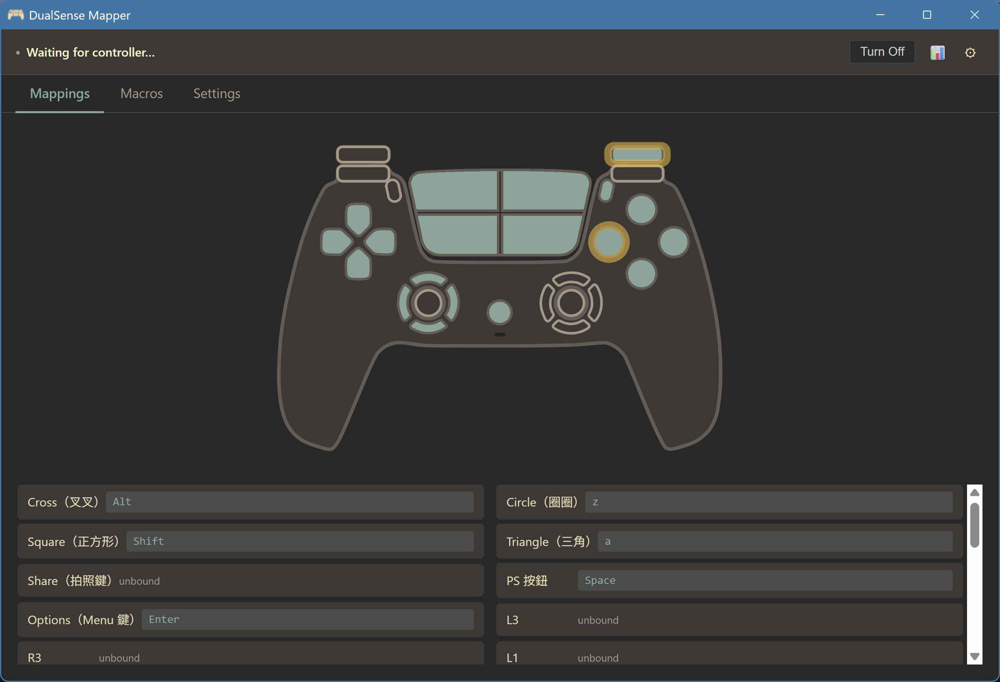

# DualSense Mapper

**English** | [繁體中文](README.zh-TW.md)

Map a PS5 DualSense controller to keyboard keys for use on a laptop. Originally written in Python in May 2025 to let my wife play MapleStory Worlds Artale comfortably on a MacBook; rewritten in Rust to ship as a single Windows executable.

  
   
  Click any button on the controller picture to bind it. Button labels come from your config file, so they can be renamed to anything.

## What you get

- **Bind by clicking the pad, not by editing JSON.** Click a button on the picture (or its row underneath) and pick Key / Macro / Mouse / Unbound.
- **29 mappable inputs** — face buttons, D-pad, both sticks as 4-way digital, L1 / R1, L2 / R2 analog triggers, L3 / R3, Share / Options / PS, plus the four touchpad quadrants.
- **The touchpad drives the mouse cursor** with a two-stage acceleration curve, and each quadrant is its own click binding.
- **Macros with randomized delays.** Every step's delay is a `[min, max]` range, never a constant tick — a looping macro doesn't fingerprint as a script.
- **No stuck keys.** Every synthesized press goes through one refcounted safety layer; `Drop` handlers plus a panic hook release everything still held even if the process dies.
- **Turn the controller off from the app** (Windows) — a Bluetooth link-level disconnect, so the pairing survives and pressing PS reconnects, exactly like a PS5.
- **One ~11 MB `.exe`.** No installer, no DLLs, no driver, no process hooking — user-mode `SendInput` only. Config is a single JSON file written next to the exe on first run.

## Get it

Download `dualsense-mapper.exe` from the [latest release](https://github.com/Luotee/dualsense-mapper/releases), pair the pad over Bluetooth, then double-click the exe. Full walkthrough and button reference: [`rust/README.md`](rust/README.md).

## Implementations

| Folder | Status | Audience |
|---|---|---|
| `legacy-python/` | Functional, frozen for reference | Developers comfortable with `pip install` |
| `rust/` | Phase 1 (Windows), Phase 2 (macOS) in progress | End users — single `.exe` |

The Rust build is the recommended path. Python is kept for blame history and because it remains usable on macOS until Phase 2 lands.

## Supported hardware

- **DualSense PS5 controller** (`054c:0ce6`) over **Bluetooth**.

Not supported yet:

- DualSense USB transport (deferred to v2.0.1).
- DualSense Edge (`054c:0df2`, deferred to v2.0.1).
- Xbox / 8BitDo / generic XInput pads — v1.2.0 is the last release with the gilrs-based generic-pad path; v2.0.0 moves to a DualSense-specific raw HID reader so the connection state, touchpad, IMU and battery can be read directly from the 78-byte HID report.

## Why this exists

Existing mapper tools dropped key-release events under load, leaving keys "stuck." The Python prototype solved this with a three-layer release-on-exit defense and a macro engine with randomized delays so that scripted-feeling input patterns don't get flagged by online games. The Rust rewrite preserves both, fixes two latent bugs from the Python version (trigger idle-value mismatch across platforms; shared-key release collision), and packages it for non-technical users.

See:

- [`rust/README.md`](rust/README.md) — build, run, button reference
- [`legacy-python/README.md`](legacy-python/README.md) — original Python notes
- [`CHANGELOG.md`](CHANGELOG.md) — per-release history
